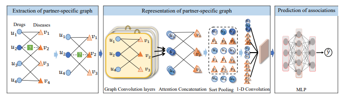

# PSGCN: Partner-specific drug repositioning approach based on graph convolutional network


# Prerequisites

```
python==3.8.1
torch==1.6.0
torch-geometric==1.6.3
torch-scatter==2.0.5
torch-sparse==0.6.8
In our experiment setting: cuda10.2
```
Note: If there is a problem with the torch-sparse installation, please use the link 
https://pytorch-geometric.com/whl/torch-1.6.0.html to download the appropriate torch-sparse version.

# How to use
```
run main.py
```
# How to cite

If you use PSGCN in an academic publication, cite as:
```
@ARTICLE{9849429,
  author={Sun, Xinliang and Wang, Bei and Zhang, Jie and Li, Min},
  journal={IEEE Journal of Biomedical and Health Informatics}, 
  title={Partner-Specific Drug Repositioning Approach Based on Graph Convolutional Network}, 
  year={2022},
  volume={},
  number={},
  pages={1-9},
  doi={10.1109/JBHI.2022.3194891}}
}
```

